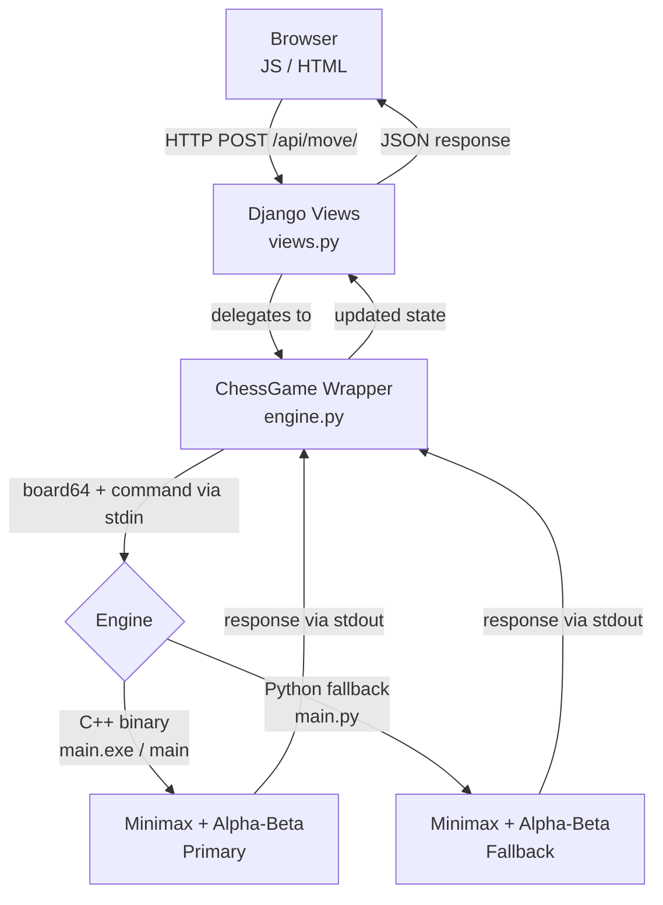

<div align="center">

# Checkora

**An open-source chess platform with an AI opponent powered by minimax search with alpha-beta pruning.**

Built on Django with a high-performance C++ engine and a Python fallback for maximum compatibility.

[](https://www.python.org/)
[](https://www.djangoproject.com/)
[](https://isocpp.org/)
[](LICENSE)
[](#tests)
[](https://github.com/Checkora/Checkora/issues)
[](CONTRIBUTING.md)
[](https://discord.gg/WfrpMuNZn)

Join our Discord community for updates, support, and games: https://discord.gg/WfrpMuNZn

**Core Maintainers (2):** [@EDWARD-012](https://github.com/EDWARD-012) / [@triemerge](https://github.com/triemerge)

Follow the core maintainers on GitHub to stay aligned with project updates and contribution direction.

</div>

---

## Features

| Feature | Description |
|---------|-------------|
| AI Opponent | Minimax search with alpha-beta pruning for challenging gameplay |
| Hybrid Engine | C++ binary for maximum speed with an automatic Python fallback |
| Full Move Validation | Legal moves enforced for all pieces including castling, en passant, and promotion |
| Game Timer | Per-player countdown clocks with pause support |
| REST API | Clean JSON endpoints powering a decoupled frontend |
| PvP & PvE Modes | Play against a friend or challenge the AI |

---

## Quick Start

```bash
# 1. Clone the repository
git clone https://github.com/Checkora/Checkora.git
cd Checkora

# 2. Set up a virtual environment
python -m venv venv
venv\Scripts\activate        # Windows
source venv/bin/activate     # macOS / Linux

# 3. Install dependencies
pip install -r requirements.txt

# 4. Run migrations and start the server
python manage.py migrate
python manage.py runserver
```

Open `http://127.0.0.1:8000/` in your browser and start playing.

### Compile the C++ Engine *(optional but recommended)*

The compiled binary is not committed to the repository. Each contributor compiles for their own platform. If the binary is absent, Checkora automatically falls back to the Python engine.

```bash
# Windows
g++ -O2 game/engine/main.cpp -o game/engine/main.exe

# macOS / Linux
g++ -O2 game/engine/main.cpp -o game/engine/main
```

---

## Architecture

Checkora uses a clean three-layer architecture:

```
Browser (JS/HTML/CSS)
       |
       v
Django Views (views.py)          <- HTTP request handling & session state
       |
       v
ChessGame Wrapper (engine.py)    <- Translates board state into engine commands
       |
       |---> C++ Binary (main.exe / main)   <- Primary: fast minimax AI
       +---> Python Script (main.py)        <- Fallback: identical logic in Python
```

| Layer | Technology | Path |
|-------|-----------|------|
| Frontend | HTML, CSS, JavaScript | `game/templates/game/board.html` |
| Backend | Django 5.x | `game/views.py`, `game/engine.py` |
| Engine (Primary) | C++17 | `game/engine/main.cpp` |
| Engine (Fallback) | Python 3.10+ | `game/engine/main.py` |

> For a full deep-dive into the backend components, execution flow, and AI internals, see the [Architecture Guide](structure.md).

### How It Works

When a player makes a move, the request flows through three layers:

1. **Browser** sends a `POST` request with the move coordinates
2. **Django** (`views.py`) receives it and delegates to the `ChessGame` wrapper in `engine.py`
3. **`engine.py`** serializes the board into a flat 64-character string and spawns the engine as a subprocess, sending commands via `stdin` and reading responses from `stdout`

The engine speaks a simple text-based protocol:

| Command | Example | Response |
|---|---|---|
| `VALIDATE` | `VALIDATE <board64> <rights> <turn> fr fc tr tc` | `VALID` / `INVALID <reason>` |
| `MOVES` | `MOVES <board64> <rights> <turn> row col` | `MOVES tr tc is_capture is_promotion ...` |
| `BESTMOVE` | `BESTMOVE <board64> <rights> <turn> <depth>` | `BESTMOVE fr fc tr tc` |
| `STATUS` | `STATUS <board64> <rights> <turn>` | `STATUS CHECK / CHECKMATE / STALEMATE / OK` |



---

## API Reference

| Method | Endpoint | Description |
|--------|----------|-------------|
| `GET` | `/` | Render the board UI |
| `POST` | `/api/move/` | Execute a player move |
| `GET` | `/api/valid-moves/` | Get legal moves for a piece |
| `POST` | `/api/new-game/` | Start a new game (PvP or PvE) |
| `GET` | `/api/check-promotion/` | Check if a move triggers pawn promotion |
| `GET` | `/api/state/` | Retrieve the full current game state |
| `POST` | `/api/pause/` | Pause or resume the game clock |
| `POST` | `/api/ai-move/` | Request and execute an AI move |

---

## Tests

The test suite runs fully in-memory — no compiled engine binary required.

```bash
python manage.py test game
```

28 tests covering all API endpoints, move validation, engine path resolution, promotion logic, and AI mode enforcement.

---

## Contributing

Contributions are welcome! Please read [CONTRIBUTING.md](CONTRIBUTING.md) for branch naming conventions, commit message format, and PR guidelines before submitting.

---

## License

Released under the [MIT License](LICENSE).
